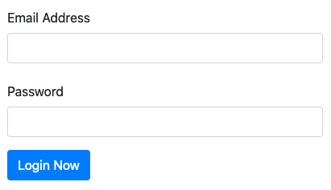

# Tutorial/Example Bootstrap Designs

Viewed & taken from Bootstrap 4 tutorial on scrimba.com

## Alerts

## Card with Two Buttons

## Card Full Features

## Form

## List Group - Links

## List Group - Plain

## Modal

## Navbar

